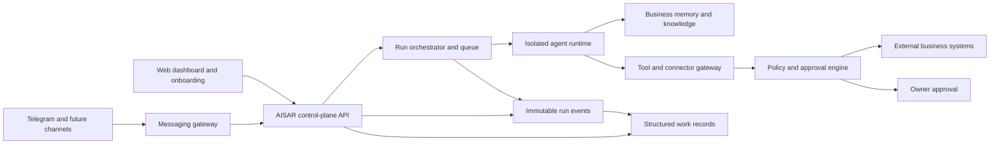

# AISAR Managed Agent Architecture

## Product Boundary

AISAR provides autonomous-agent capability as a managed business service. The owner describes an outcome, connects existing accounts, and approves sensitive decisions. AISAR chooses and operates the models, tools, skills, schedules, and infrastructure.

Hermes can be an initial agent runtime, but it must sit behind an AISAR runtime adapter. AISAR—not the runtime—owns tenant isolation, business memory, permissions, approvals, integrations, audit history, billing, and the customer experience. This keeps the product portable across agent and model providers.

The current repository is a static product prototype. The services below are the backend required to make its experience real.

## First Complete Product Loop

```text
Import website/socials
        ↓
Build a reviewable business profile and memory
        ↓
Owner asks AISAR or AISAR proposes useful work
        ↓
Agent prepares a tool action
        ↓
Policy engine executes, requests approval, or blocks
        ↓
Connector performs the action
        ↓
Structured work record captures the result and updates memory
```

The first implementation should use Telegram because it supports both owner interaction and customer messaging with a relatively direct integration path. WhatsApp follows through the same connector contract.

## System Components



### Control Plane

- Authenticates owners and resolves the active business tenant.
- Stores business profiles, goals, permissions, connections, and automation policies.
- Exposes APIs for onboarding, Ask AISAR, Activity, approvals, and My Business.
- Never gives the browser direct access to model or connector credentials.

### Agent Runtime

- Runs each task in a tenant-isolated workspace with explicit tool access.
- Supports memory, skills, planning, delegation, and long-running jobs.
- Uses a provider-neutral adapter such as `startRun`, `resumeRun`, `cancelRun`, and `streamEvents`.
- Receives short-lived scoped credentials; it does not own master secrets.

### Business Memory

- Separates verified business facts, uploaded knowledge, conversation history, and learned preferences.
- Attaches source, confidence, owner confirmation, and last-updated time to important facts.
- Makes all durable knowledge reviewable and correctable in My Business.
- Versions agent-created procedures; self-improvement never silently replaces a live workflow.

### Connector Gateway

- Presents stable AISAR tools such as `telegram.sendMessage`, `calendar.createBooking`, and `crm.updateLead`.
- Handles OAuth, credential refresh, rate limits, retries, idempotency, and provider-specific APIs.
- Prefers APIs over browser automation; browser execution is a restricted fallback.

### Policy, Approval, and Audit

Every proposed tool action is classified before execution:

- **Automatic:** read-only access and reversible, low-risk internal updates.
- **Approval required:** customer messages, bookings, discounts, exports, or material record changes.
- **Blocked:** payments, destructive actions, or access outside the business policy until explicitly enabled.

An approval stores the exact action, parameters, risk, expiry, and approving owner. Every run records its inputs, model/runtime version, tool calls, results, cost, and final outcome.

### Structured Work Records and Technical Trace

Chat transcripts and raw agent logs are evidence, not the owner-facing activity model. Every run emits append-only events such as `work.requested`, `work.started`, `action.proposed`, `approval.requested`, `action.executed`, `work.completed`, and `work.failed`. A projector turns those events into a concise work record for Home and Activity.

A work record should contain:

- business objective and plain-language outcome;
- business function, channel, customer or subject, and parent batch;
- current status: queued, working, needs approval, completed, failed, or cancelled;
- risk level, approval reference, timestamps, and responsible runtime;
- useful counters, estimated time saved, cost, and links to created artifacts;
- a short owner-facing summary plus a separate immutable technical trace.

Repeated child records are grouped by business meaning and time window. For example, 18 Telegram replies can appear as one daily enquiry summary while each delivery remains individually traceable. Digests, notifications, and dashboard metrics must be generated from structured work records, not by asking a model to reinterpret a long transcript.

The UI reveals information progressively:

1. **Summary:** what happened and whether the owner is needed.
2. **Business details:** customer, channel, result, time saved, and related records.
3. **Technical trace:** source messages, prompts, retrieved knowledge, tool calls, model/runtime version, errors, and retry history.

## Suggested Infrastructure

- Keep the static frontend on Cloudflare Pages.
- Add a TypeScript control-plane API using Cloudflare Workers.
- Use Cloudflare Queues/Workflows for durable coordination and retries.
- Run Hermes or another full agent runtime in isolated containers outside Workers; terminal and browser tasks require a real sandboxed compute environment.
- Store relational state in managed Postgres with row-level tenant isolation; add vector retrieval only where normal indexed search is insufficient.
- Store imported documents and large run artifacts in the existing private R2 environment.
- Keep credentials in a managed secret vault and issue short-lived connector grants.

## MVP Delivery Plan

### Phase 1 — Know the Business

- Import a website and manually supplied business information.
- Extract facts into a review screen with source and confidence.
- Persist business memory.
- Make Ask AISAR answer from verified business context and live activity data.
- Persist each request and proposed action as a structured work record, separate from chat text.

### Phase 2 — Prepare and Approve Work

- Connect an owner Telegram account and one customer-facing Telegram bot.
- Let AISAR draft a customer reply from the business profile.
- Create an approval card containing the exact proposed message.
- Send only after approval and record the delivery result in Activity.
- Group multiple Telegram replies into an automatic outcome summary while preserving per-message traceability.

### Phase 3 — Managed Autonomy

- Allow owners to mark narrow action categories as automatic.
- Add schedules, event triggers, retry policies, and proactive recommendations.
- Add WhatsApp and calendar connectors through the same contracts.

### Phase 4 — Learning Business Operator

- Convert successful repeated runs into versioned business procedures.
- Test procedure updates against historical cases before activation.
- Add specialist delegation behind the single AISAR identity.

## Vertical-Slice Acceptance Criteria

The first production slice is complete when a non-technical owner can:

1. submit a business URL and confirm the extracted profile;
2. connect Telegram without handling API keys manually;
3. ask AISAR to respond to a realistic enquiry;
4. review and approve the exact outgoing message;
5. see successful delivery and a complete activity record; and
6. correct a business fact and have the next response use the correction.

The owner must be able to understand what happened from the Home and Activity summaries without reading the Ask AISAR or Telegram transcript. Expanding a record must still reveal the exact source message, approved action, delivery result, and technical trace.

The primary metric remains **time to first useful work completed**. Track import completion, time to first approved action, successful execution rate, approval rate, correction rate, owner intervention per completed task, and how often owners must open the technical trace to understand an outcome.

## Non-Goals for the First Release

- A public workflow, prompt, model, or agent builder.
- Unrestricted terminal or browser access.
- Fully autonomous payments or destructive operations.
- A large integration marketplace before one complete workflow is reliable.
- Chat transcripts or raw tool logs as the primary activity interface.
- Unreviewed self-modifying skills in production.
