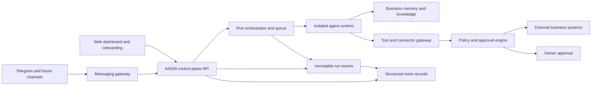

# AISAR Managed Agent Architecture

## Product Boundary

AISAR provides autonomous-agent capability as a managed business service. The owner describes an outcome, connects existing accounts, and approves sensitive decisions. AISAR chooses and operates the models, tools, skills, schedules, and infrastructure.

Hermes can be an initial agent runtime, but it must sit behind an AISAR runtime adapter. AISAR—not the runtime—owns tenant isolation, business memory, permissions, approvals, integrations, audit history, billing, and the customer experience. This keeps the product portable across agent and model providers.

The current repository is a static product prototype. The services below are the backend required to make its experience real.

## First Complete Product Loop

```text
Import website/socials
        ↓
Build a reviewable business profile and memory
        ↓
Owner asks AISAR or AISAR proposes useful work
        ↓
Agent prepares a tool action
        ↓
Policy engine executes, requests approval, or blocks
        ↓
Connector performs the action
        ↓
Structured work record captures the result and updates memory
```

The first implementation should use Telegram because it supports both owner interaction and customer messaging with a relatively direct integration path. WhatsApp follows through the same connector contract.

## System Components



### Control Plane

- Authenticates owners and resolves the active business tenant.
- Stores business profiles, goals, permissions, connections, and automation policies.
- Exposes APIs for onboarding, Ask AISAR, Activity, approvals, and My Business.
- Never gives the browser direct access to model or connector credentials.

### Edge Abuse and Cost Containment

- Stop floods at the Cloudflare zone WAF before Worker invocation; Worker rate-limit
  bindings are a second, per-colo brake before session, database, queue, email, runtime,
  or model work.
- Use separate limits for authentication, ordinary API traffic, connector webhooks, and
  high-cost mutations such as provisioning. Key authenticated traffic by stable opaque
  identity where possible and keep an IP brake on unauthenticated expensive routes.
- Reject unsupported methods, oversized bodies, and excessive request targets before
  parsing. Emit bounded, secret-free refusal logs with `Retry-After` and no-store errors.
- Treat provider throttles as burst protection, not billing truth. Durable per-business
  ledgers, concurrency admission, capped/expiring model keys, and maximum run/tool budgets
  are authoritative spend controls.
- Never retry overload signals blindly. Retry only idempotent operations with bounded
  exponential backoff and dead-letter inspection; provisioning is exact-name idempotent.

### Agent Runtime

- Runs each task in a tenant-isolated workspace with explicit tool access.
- Supports memory, skills, planning, delegation, and long-running jobs.
- Uses a provider-neutral adapter such as `startRun`, `resumeRun`, `cancelRun`, and `streamEvents`.
- Places a narrow AISAR-owned agent runner in front of Hermes for workload identity,
  task leases, event translation, usage metering, health, and upgrades. The control plane
  does not depend directly on Hermes' process model.
- Executes one active task per business runtime in the first release; queued work remains
  durable until the current lease finishes or pauses for approval.
- Receives short-lived scoped credentials; it does not own master secrets.

### Business Memory

- Separates verified business facts, uploaded knowledge, conversation history, and learned preferences.
- Attaches source, confidence, owner confirmation, and last-updated time to important facts.
- Makes all durable knowledge reviewable and correctable in My Business.
- Versions agent-created procedures; self-improvement never silently replaces a live workflow.

### Connector Gateway

- Presents stable AISAR tools such as `telegram.sendMessage`, `calendar.createBooking`, and `crm.updateLead`.
- Handles OAuth, credential refresh, rate limits, retries, idempotency, and provider-specific APIs.
- Terminates provider webhooks and push events centrally so cold runtimes do not maintain
  Telegram, WhatsApp, Slack, email, or calendar connections.
- Prefers APIs over browser automation; browser execution is a restricted fallback.

### Policy, Approval, and Audit

Every proposed tool action is classified before execution:

- **Automatic:** read-only access and reversible, low-risk internal updates.
- **Approval required:** customer messages, bookings, discounts, exports, or material record changes.
- **Blocked:** payments, destructive actions, or access outside the business policy until explicitly enabled.

An approval stores the exact action, parameters, risk, expiry, and approving owner. Every run records its inputs, model/runtime version, tool calls, results, cost, and final outcome.

### Structured Work Records and Technical Trace

Chat transcripts and raw agent logs are evidence, not the owner-facing activity model. Every run emits append-only events such as `work.requested`, `work.started`, `action.proposed`, `approval.requested`, `action.executed`, `work.completed`, and `work.failed`. A projector turns those events into a concise work record for Home and Activity.

Realtime model deltas, chain-of-thought, and intermediate chat narration are transport,
not business state. They may be forwarded live after redaction but are never persisted in
Neon, Durable Object storage, logs, or Activity. Persist only the bounded structured facts
needed to resume and audit work: objective, status, approvals, todos/checkpoints,
artifacts, usage, outcome, and the final customer-visible action where accountability
requires it. This keeps context queryable without rebuilding it from a chat transcript.

A work record should contain:

- business objective and plain-language outcome;
- business function, channel, customer or subject, and parent batch;
- current status: queued, working, needs approval, completed, failed, or cancelled;
- risk level, approval reference, timestamps, and responsible runtime;
- useful counters, estimated time saved, cost, and links to created artifacts;
- a short owner-facing summary plus a separate immutable technical trace.

Repeated child records are grouped by business meaning and time window. For example, 18 Telegram replies can appear as one daily enquiry summary while each delivery remains individually traceable. Digests, notifications, and dashboard metrics must be generated from structured work records, not by asking a model to reinterpret a long transcript.

The UI reveals information progressively:

1. **Summary:** what happened and whether the owner is needed.
2. **Business details:** customer, channel, result, time saved, and related records.
3. **Technical trace:** source messages, prompts, retrieved knowledge, tool calls, model/runtime version, errors, and retry history.

### Beginner and Advanced Disclosure

Owners differ in how much they want to see. That difference is served by the three levels above, not by a second interface.

An account carries a detail preference. In **beginner** mode—the default—level 1 is shown and levels 2 and 3 are collapsed. In **advanced** mode level 3 is expanded by default and a small set of controls is unlocked: per-operation action policy, and the ability to edit a proposed action before approving it.

This is one codebase, one backend, and one information architecture with a preference applied. A separate "advanced UI" is not planned, because every feature would then have to decide which of two interfaces it belongs to, and both would have to be designed, tested, and kept consistent forever.

Draft editing is listed here as a disclosure control, but it is not a convenience. The delta between what AISAR proposed and what the owner approved is the strongest correction signal the product will ever receive, and Procedure Derivation Requirements below depends on it being captured as a first-class event rather than an overwritten field.

What advanced mode does **not** unlock in the first release: model selection, custom instructions, custom tools, terminal or browser access, and agent-runtime choice. Those are separate decisions with their own costs, addressed under Non-Goals and in the delivery plan.

### Procedure Derivation Requirements

Phase 4 converts successful repeated runs into versioned business procedures. It has no separate source of truth: it mines the work records and traces that Phase 2 writes. Anything not captured then cannot be recovered later, so the recording requirements below belong to Phase 2 even though nothing consumes them until Phase 4.

Each run should additionally record:

- **Trigger shape.** Not only the channel and customer, but what pattern caused the run — an inbound enquiry about pricing, a scheduled weekly report, a direct owner instruction. Two runs belong to the same candidate procedure when their trigger shapes match, so this is the grouping key.
- **Decision taken.** Which option AISAR chose and the business reason, in a form that can be compared across runs. "Offered a consultation call" is derivable; "called the messaging tool" is not.
- **Inputs relied upon.** Which business facts and connector data the decision used, so a procedure can declare its preconditions and a later fact correction can invalidate the runs that depended on the old value.
- **Owner corrections.** The delta between what AISAR proposed and what the owner actually approved. An approve or reject is a weak signal; an edit is the strongest one available, and it is the easiest to lose because it arrives as a modified draft rather than an event. Edits must be recorded as first-class events, with both versions retained.
- **Outcome quality.** Whether the result held: the customer replied, the booking was kept, no refund followed, the owner did not intervene afterwards. Success at execution time is not the same as success in the business.

A procedure becomes a candidate when a trigger shape recurs, the same decision was taken, and outcome quality was good across a threshold of runs. Candidates are proposed to the owner in business language, never as a skill or a workflow. Activation requires replay against historical cases, as Phase 4 already specifies.

This is also where the product becomes difficult to copy. Industry playbooks are a month of work for a competitor. A year of one business's tested, versioned procedures, each derived from its own run history and corrections, is not.

## Suggested Infrastructure

- Keep the static frontend on Cloudflare Pages.
- Add a TypeScript control-plane API using Cloudflare Workers.
- Use Cloudflare Queues/Workflows for durable coordination and retries.
- Run Hermes or another full agent runtime in isolated containers outside Workers; terminal and browser tasks require a real sandboxed compute environment.
- Use one Fly Sprite per business for the first hosted Hermes runtime. Provision lazily,
  keep Hermes behind the AISAR control plane, and revisit Cloudflare Containers or a
  shared EC2 fleet when measured duty cycle or durable-container support changes the
  trade-off. See
  [`docs/superpowers/specs/2026-08-26-hermes-sprites-runtime.md`](docs/superpowers/specs/2026-08-26-hermes-sprites-runtime.md).
- Store relational state in managed Postgres with row-level tenant isolation; add vector retrieval only where normal indexed search is insufficient.
- Store imported documents and large run artifacts in the existing private R2 environment.
- Keep credentials in a managed secret vault and issue short-lived connector grants.

## MVP Delivery Plan

### Phase 1 — Know the Business

- Import a website and manually supplied business information.
- Extract facts into a review screen with source and confidence.
- Persist business memory.
- Make Ask AISAR answer from verified business context and live activity data.
- Keep ordinary Ask AISAR inline and fast. Route the explicit production-canary
  "Work on this" action through a durable, tenant-scoped Hermes task, with authenticated
  hibernating-WebSocket lifecycle progress and bounded polling only as recovery.
- Route verified Telegram messages for execution-canary businesses through the same
  durable Hermes task plane. Deduplicate on the Telegram connection/chat/message identity,
  re-check send policy at completion, and retain only structured state plus the final sent
  reply—not Hermes reasoning, token deltas, or raw transcripts.
- For automatic private Telegram replies, relay allow-listed `message.delta` output as an
  ephemeral live draft. The per-business runner is Hermes's sole SSE subscriber and drops
  reasoning, tools, approvals, unknown events, and terminal transcripts before the control
  plane; neither runner disk nor Postgres stores token chunks.
- Persist each request and proposed action as a structured work record, separate from chat text.

### Phase 2 — Prepare and Approve Work

- Connect an owner Telegram account and one customer-facing Telegram bot.
- Let AISAR draft a customer reply from the business profile.
- Create an approval card containing the exact proposed message.
- Send only after approval and record the delivery result in Activity.
- Group multiple Telegram replies into an automatic outcome summary while preserving per-message traceability.
- Record trigger shape, decision taken, inputs relied upon, owner corrections, and outcome quality on every run. See Procedure Derivation Requirements: Phase 4 has no other source, and an owner edit is the strongest signal available and the easiest to lose.

### Phase 3 — Managed Autonomy

- Allow owners to mark narrow action categories as automatic.
- Add schedules, event triggers, retry policies, and proactive recommendations.
- Add WhatsApp and calendar connectors through the same contracts.

### Phase 4 — Learning Business Operator

- Convert successful repeated runs into versioned business procedures, derived from the Phase 2 run history rather than authored by hand.
- Test procedure updates against historical cases before activation.
- Add specialist delegation behind the single AISAR identity.

## Vertical-Slice Acceptance Criteria

The first production slice is complete when a non-technical owner can:

1. submit a business URL and confirm the extracted profile;
2. connect Telegram through a guided flow;
3. ask AISAR to respond to a realistic enquiry;
4. review, edit if wanted, and approve the exact outgoing message;
5. see successful delivery and a complete activity record; and
6. correct a business fact and have the next response use the correction.

Criterion 2 was previously written as "connect Telegram without handling API keys
manually." Telegram offers two connection paths and only one of them is tokenless: a
business account can attach an existing bot from its own settings, which needs no token
and does not require Telegram Premium, but it covers only chats the owner already has,
permits one connected bot per account, and exposes a narrower API surface. The first
release therefore uses a guided walkthrough in which the owner creates a bot and supplies
its token once, and the tokenless path is added later behind the same connector contract.
The original promise is deferred, not abandoned. Reasoning in
`docs/superpowers/specs/2026-08-21-backend-integration-design.md`.

The owner must be able to understand what happened from the Home and Activity summaries without reading the Ask AISAR or Telegram transcript. Expanding a record must still reveal the exact source message, approved action, delivery result, and technical trace.

The primary metric remains **time to first useful work completed**. Track import completion, time to first approved action, successful execution rate, approval rate, correction rate, owner intervention per completed task, and how often owners must open the technical trace to understand an outcome.

## Non-Goals for the First Release

- A public workflow, prompt, model, or agent builder. Advanced disclosure is bounded to inspection and to the two controls named above—per-operation action policy and draft editing. It does not extend to composing workflows, authoring prompts, selecting models, or choosing an agent runtime.
- Unrestricted terminal or browser access.
- Fully autonomous payments or destructive operations.
- A large integration marketplace before one complete workflow is reliable.
- Chat transcripts or raw tool logs as the primary activity interface.
- Unreviewed self-modifying skills in production.

## Open Questions

Recorded so the reasoning is not lost. Neither is scheduled, and neither should compete with Phase 1.

### Dashboard customisation

Should owners be able to arrange or personalise their dashboard?

The case for: the generated dashboard is a playbook template with the owner's name applied, and it does not yet feel like their business.

The case against: it contradicts the core promise. The product exists because customers "value a working outcome more than a configurable platform", and a layout editor hands implementation decisions back to exactly the customer who said they did not know where to begin. It also ends the property that makes twenty industries cheap to support, since per-owner layout state means migrations and divergent support cases forever.

Current position: the underlying complaint is most likely content, not layout. A dashboard filled with a real business's imported services and channels should stop feeling generic without any layout control. Re-evaluate after Phase 1, when that can actually be observed.

If some form of ownership is wanted sooner, two cheaper answers cover most of it:

- **Business identity** — logo, name, brand colour, and reply tone. Visible to the owner's own customers, near-zero decision burden, no layout state.
- **Correction in place** — every dashboard element can be marked wrong or irrelevant, and the system learns. This is customisation as teaching, which improves the product rather than merely differentiating one instance of it, and it feeds the same run history Phase 4 depends on.

### Surfacing skills as an owner-facing concept

Should the agent-runtime skill model be exposed to owners?

No, on the product's own terms. Owner-facing language avoids models, prompts, APIs, agent counts, and workflow builders; "skill" belongs to that vocabulary. The capability is already planned as Phase 4 under the name that suits the audience — versioned business procedures — and internal complexity is meant to stay behind the product.

The runtime's skill mechanism remains an implementation detail behind the provider-neutral adapter. Adopting an existing agent framework's skill format wholesale would import its developer-facing shape, and with it its audience.
