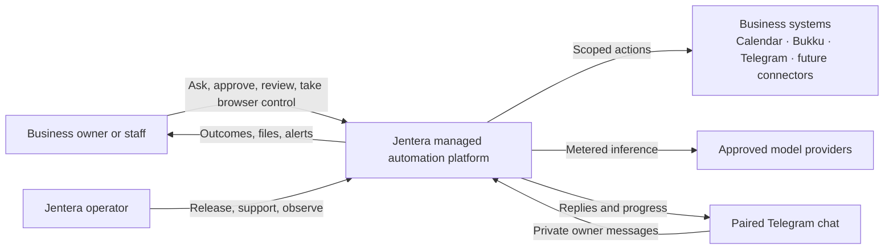
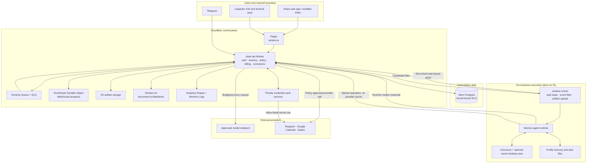
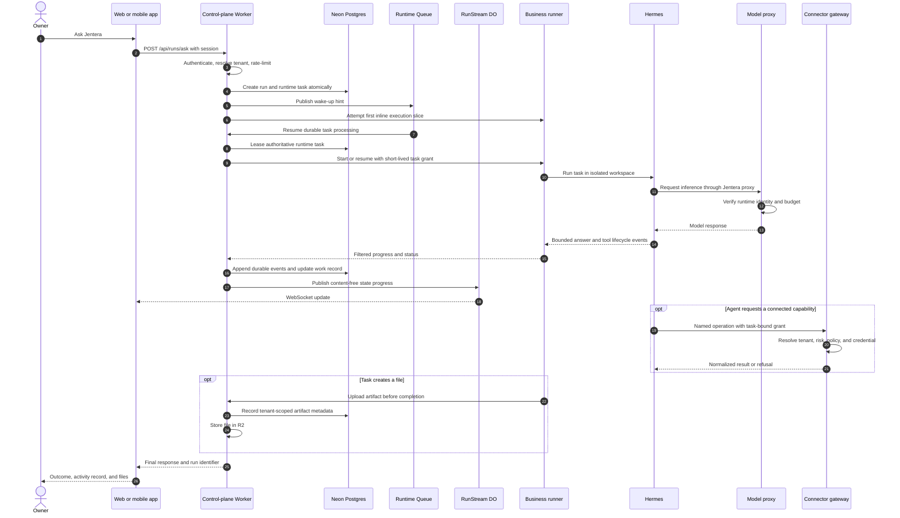
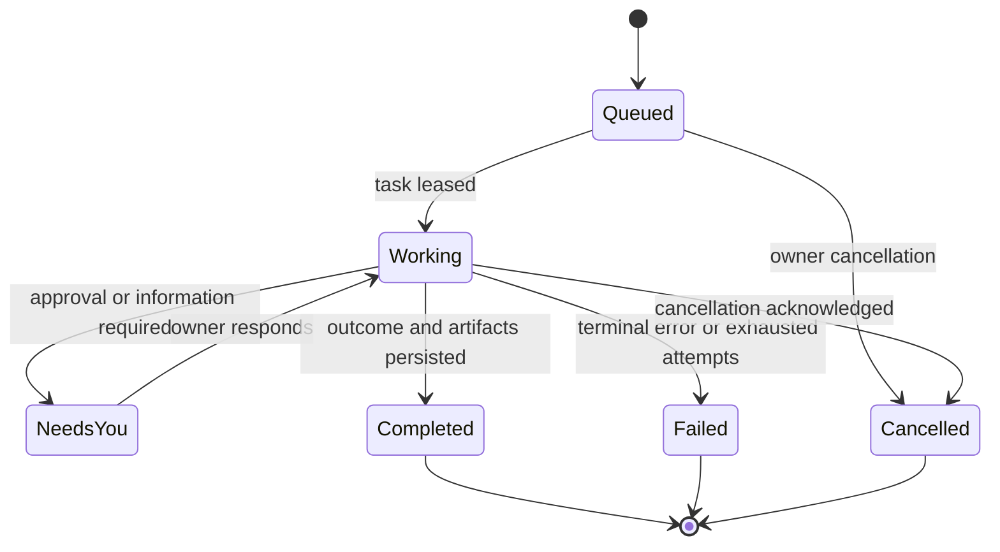
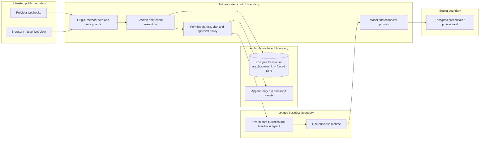
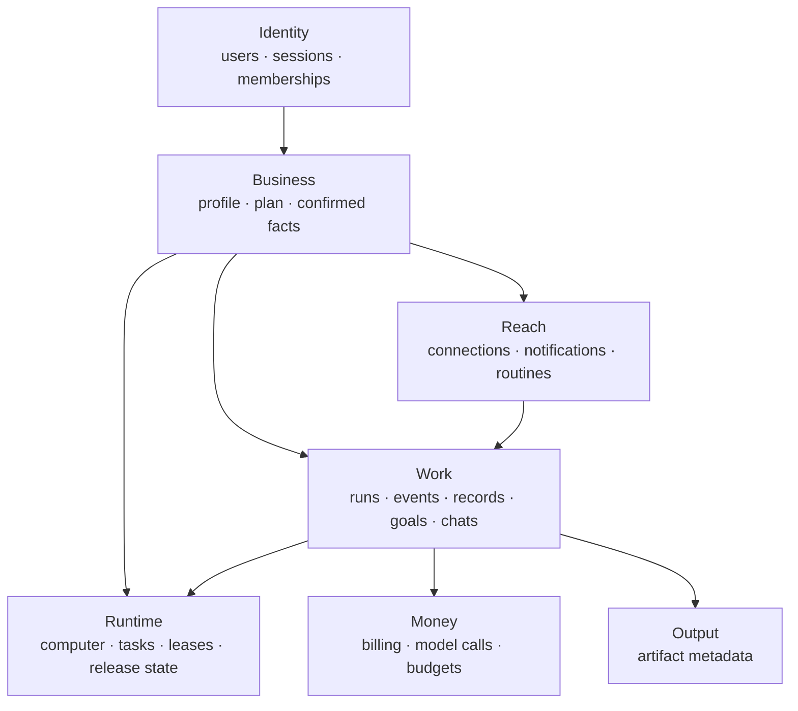
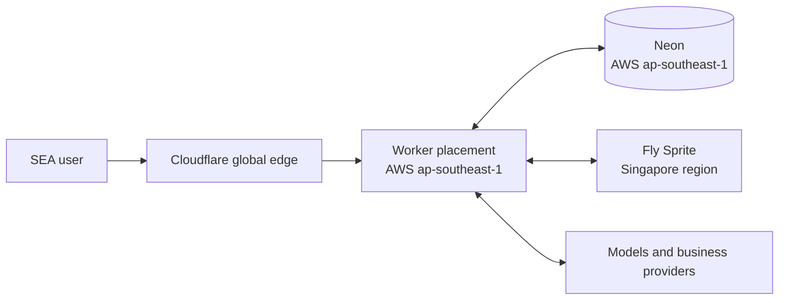

# Jentera system architecture design

> Presentation view of the production system, dated 23 September 2026.
> This document explains the architecture at a glance. For implementation
> details and operational history, use [`architecture.md`](architecture.md).
> For product boundaries and longer-term intent, use
> [`../TECHNICAL_ARCHITECTURE.md`](../TECHNICAL_ARCHITECTURE.md).

## 1. Executive summary

Jentera is a managed business-automation system. A business owner talks to
Jentera through the web app, native shell, or a paired Telegram chat. The
Cloudflare control plane authenticates the owner, applies tenant and policy
boundaries, records work, and dispatches a task to a persistent, isolated
computer for that business. The computer runs the Jentera runner, Hermes,
and a browser. Models and connected services remain behind control-plane
proxies so the agent does not receive master credentials.

The architecture has three primary infrastructure anchors:

- **Cloudflare is the control plane and delivery edge.** It hosts the web app,
  API, queues, live progress, artifacts, request limits, and private vault
  bindings.
- **Fly Sprites are the execution plane.** Each business has one isolated,
  persistent computer that runs the agent and its browser.
- **Neon Postgres is the system of record.** It stores identity, tenancy,
  work, runtime state, knowledge, approvals, plans, and metering under forced
  row-level security.

The most important design rule is:

> The runtime may reason and request capabilities; the control plane decides
> what it may read, persist, or execute.

## 2. System context

### Product responsibilities

| Boundary | Responsibility |
|---|---|
| **Jentera Control** | Identity, tenancy, policy, approvals, secrets, budgets, audit, billing, and work records |
| **Jentera Compute** | Persistent isolated business computers, task execution, files, browser, recovery, and metering |
| **Jentera Connect** | Stable business capabilities, provider adapters, credential use, normalization, and webhooks |
| **Jentera Solutions** | Owner-facing workers, procedures, and completed business outcomes |

These are product boundaries, not separate services in every case. The current
Cloudflare Worker implements much of Control and the first Connect surface;
the per-business Sprite implements Compute; the web and channel experiences
present Solutions.

## 3. Container architecture

### Independently deployed units

| Unit | Source | Runtime | Release path |
|---|---|---|---|
| Web app | `app/` | Cloudflare Pages | `./deploy.sh` |
| Control plane | `worker/` | Cloudflare Worker | Wrangler / runtime release script |
| Agent host | `runner/` plus pinned Hermes | One Fly Sprite per business | `worker/scripts/ship-runtime.sh` |
| Native shell | `mobile/` | Capacitor iOS and Android | Xcode / Gradle |
| Credential vault | Separate private project | Cloudflare Workers service bindings | Separate controlled release |

## 4. Core request and execution flow

### Why the queue message is not the task

Queue delivery is at least once, so the queue contains only a wake-up hint.
The task kind, payload, tenant, status, and lease are read from Postgres. A
duplicate message therefore cannot invent or duplicate paid work. The database
row is authoritative and the queue only asks the system to look at it.

### Work state model

Chat text is an interface. The durable business record is the run, its
append-only events, approvals, artifacts, usage, and projected work record.

## 5. Trust and security boundaries

### Security invariants

1. **The request body never selects the tenant.** `resolveTenant` derives it
   from the authenticated identity; runtime routes derive it from the runtime
   credential.
2. **Tenant tables enforce row-level security.** Each transaction sets a local
   `app.business_id`, and the Worker connects as the non-owner `aisar_app`
   role so Postgres cannot silently bypass the policies.
3. **A runtime never owns master connector credentials.** It requests a named
   operation; the control plane or private vault loads the credential only at
   the moment of use.
4. **Model access is proxied and metered.** The runtime receives a derived
   credential for Jentera's proxy, not the upstream provider secret.
5. **Every runtime grant is short-lived and task-bound.** A grant cannot be
   replayed for another tenant or another task.
6. **Sensitive actions fail closed.** Low-risk reads may execute; actions above
   the current approval capability are refused until an inspectable approval
   continuation exists.
7. **Technical reasoning is not durable business state.** The runner filters
   internal reasoning, full tool arguments, terminal transcripts, and unknown
   events before they cross the runtime boundary.
8. **Owner browser control is exclusive.** While the owner holds the shared
   browser, agent browser tools fail fast. Hand-back is explicit and survives
   process restarts.

## 6. Data architecture

### Storage ownership

| Store | Owns | Does not own |
|---|---|---|
| Neon Postgres | Authoritative identity, tenant, work, policy, plan, runtime, knowledge, and metering state | Large generated files or live token transport |
| R2 | Generated reports, spreadsheets, and other task artifacts | Access control metadata; reads are authorized through Postgres first |
| RunStream Durable Object | Ephemeral, replay-bounded live progress fan-out | Final answers, reasoning, or the system of record |
| Sprite filesystem | Per-business browser profile, task workspace, small profile memory | Cross-tenant state or authoritative Jentera records |
| Private vault | Master secrets and allow-listed secret use | Business logic or tenant selection from client input |
| Browser storage | Local demo mode, drafts, and completed chat presentation state | Production tenant authority |

### Knowledge model

Jentera intentionally uses three different knowledge stores:

- **Business facts** are reviewable, sourced, confidence-aware records in the
  control plane. Agent proposals remain unconfirmed until an owner accepts
  them.
- **Ingested knowledge** is extracted from supported documents or public pages
  into proposed facts. The original uploaded file is not retained by the
  knowledge flow.
- **Agent profile memory** is a small per-profile store on the business
  computer for learned working preferences that are not authoritative
  business facts.

## 7. Availability, recovery, and cost controls

| Concern | Design response |
|---|---|
| Duplicate queue delivery | Postgres task leases and idempotent dispatch; queue messages are hints |
| Runtime interruption | Persistent Sprite, runner state, checkpoints, bounded retries, and DLQ |
| Slow cold start | One-hour runtime keepalive plus inline first execution slice |
| Fleet drift | Immutable runtime release, quarter-hour reconciliation, and fleet verification |
| Provider or model overspend | Edge rate limits, per-run metering, tenant budget checks, and hard execution gates |
| Live connection loss | Durable work continues independently of the browser WebSocket |
| Partial artifact completion | Runner uploads artifacts before reporting the task complete |
| Push delivery failure | Transactional outbox with bounded retry |
| Credential compromise radius | One runtime per business, scoped grants, encrypted control-plane secrets, and provider allowlists |

No single client connection owns a task. The owner may close the browser and
return to the same durable run through Activity.

## 8. Deployment topology

Placing the Worker beside Neon keeps tenant-scoped database transactions near
the authoritative store. Business computers run in Singapore to keep the
execution plane close to the initial customer region. The global Cloudflare
edge remains the admission and delivery layer.

### Release boundaries

- A web release changes customer presentation but not the runtime fleet.
- A Worker release changes the control plane and may change API contracts.
- A runtime release pins an immutable repository commit, upgrades the fleet,
  verifies readiness, and preserves a rollback checkpoint.
- A native release packages a frozen web build; it must not point a privileged
  production WebView at a mutable remote `server.url`.

## 9. Current capability versus intended expansion

| Area | Production now | Designed next |
|---|---|---|
| Owner surfaces | Web/PWA, private paired Telegram, Capacitor shell | Verified native auth and broader channel parity |
| Compute | One persistent Sprite and one active task per business | Provider portability behind the compute lifecycle boundary |
| Connectors | Telegram, Google Calendar, and Bukku are real | Additional regional systems through canonical primitives and adapters |
| Browser | Shared Chromium, restricted owner control, allow-listed desktop pilot | Wider release after security and operational gates |
| Knowledge | Confirmed facts, imports, small agent memory | Better provenance, corrections, and procedure derivation |
| Approval | Policy/risk classification and durable approval model | Complete pause-and-resume for every sensitive runtime tool path |
| Procedures | Routines and bounded demonstration recording | Versioned reusable business procedures derived from proven work |
| Native | Packaged shells; production native auth disabled | Universal/App Link callback verification, push, and store releases |

The system should expand by adding capabilities behind the existing control,
tenant, and audit boundaries—not by granting the runtime broader credentials.

## 10. Architectural decisions

| Decision | Reason |
|---|---|
| One isolated computer per business | Strong isolation, persistent browser state, simple ownership, bounded compromise radius |
| Control plane separate from agent runtime | Runtime and model portability without losing tenant, policy, audit, or billing ownership |
| Postgres as task authority | Durable leases and idempotency under at-least-once queue delivery |
| Forced RLS plus explicit tenant predicates | Database-enforced isolation with readable defense in depth |
| Proxy models and connectors | Central budget, policy, secret, and audit enforcement |
| Structured work records beside chat | Activity and accountability survive UI, model, and transcript changes |
| Progressive disclosure | Owners see outcomes first; support can inspect technical trace without maintaining two products |
| APIs before browser automation | More reliable, testable, and governable actions; browser use remains a constrained fallback |

## 11. Known architectural pressure points

These are current engineering risks, not hidden assumptions:

- The placed execution slice uses a second Worker invocation to avoid high
  queue-consumer-to-database latency. It is effective but increases invocation
  count and deserves a durable location-aware orchestration replacement.
- Runtime orchestration has grown across large modules and many tenant
  transactions; transaction count and database time per run need better
  measurement and decomposition.
- The spare runtime pool is disabled, so new businesses pay cold provisioning
  time until pool preparation is diagnosed and safely restored.
- Hyperdrive query caching is disabled globally to protect session-sensitive
  reads; isolating those reads could recover safe caching elsewhere.
- Approval continuation is not yet uniform across all Hermes-native tool
  paths, so higher-risk connector operations fail closed.
- Most planned connectors remain stubs pending provider registration and a
  verified adapter implementation.

## 12. Design review checklist

Any new subsystem or connector should answer all of these before release:

1. How is the tenant derived without trusting a caller-provided business id?
2. What is the authoritative state, and how is duplicate delivery handled?
3. Which credentials are needed, where are they stored, and can the runtime
   ever read their plaintext?
4. What risk class does each operation have, and where can it pause for owner
   approval?
5. Which events and outcomes are persisted without storing private reasoning or
   unnecessary payloads?
6. How does the owner see progress, failure, recovery, and the final business
   result?
7. What rate, concurrency, cost, and file-size bounds apply before expensive
   work begins?
8. How is the change deployed, rolled back, and verified across the fleet?
9. What happens when the client disconnects, the queue redelivers, the runtime
   restarts, or the provider times out?
10. Which production capability gate keeps an unfinished path fail-closed?
